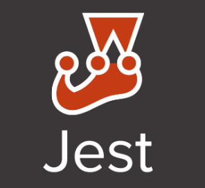
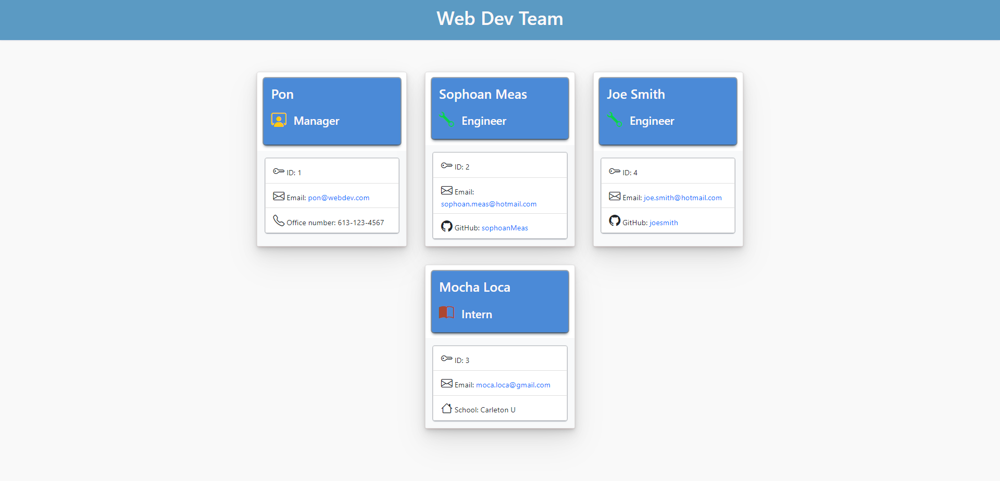

<h1 align="center">Team Profile Generator </h1>

---

# Description

This app allows the user to generate a team profile web application. This tool allows you to add "manager", "egineer" or "intern" as an employee. When you run the tool it will prompt you with a series of command-line questions to add info for your employee.

# Table of Contents

[Installation](#installation)

[Usage](#usage)

[Contribution](#contribution)

[Tests](#test)

[Questions](#questions)

[License](#license)

# Installation

1. First have Node.js installed
2. clone the repo and in your terminal type `git clone https://github.com/SophoanMeas/team-profile-generator.git`
3. type `npm i` in the terminal to install all the node dependencies
4. type `node index.js` to run the app
 
# Usage

- Run the app by typing `node index.js` in the terminal. 
- A series of cmd-line prompt questions will guide you through the process. 
- Provide the necessary information when prompt to add your employee to your team profile.
- When completed a index.html will be generated in the folder "dist"
- When prompt for "License" please indicated which license you have added to your repo.
- A license badge will be added below the project title
# Contribution

N/A

# Test

Unit Test with Jest

Run `npm test` to run Jest to test all the .test.js files

Run `npm test` (Class Name) etc. `npm test Employee` to test only Employee Class
# Questions

---

<h1 align="center">Contact Me</h1>

Check out my Github for more projects

Have a question? Feel free to drop me an email.

📧[sophoan.meas@hotmail.com](mailto:sophoan.meas@hotmail.com)

---

# License

#### Copyright© [sophoanMeas](https://github.com/sophoanMeas). All rights reserved.
#### Licensed under *GNU*

---

## Screenshot

## Tutorial Video

